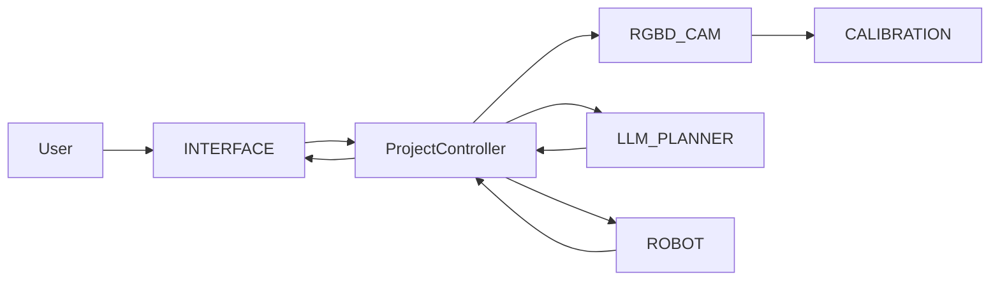

# 발표용 아키텍처 요약

## 한 문장 소개
이 프로젝트는 RGBD 카메라 인식, LLM 기반 작업 계획, 로봇 action 실행, 사용자 인터페이스, 카메라-로봇 캘리브레이션을 하나의 제어 흐름으로 연결하는 지능형 로봇 제어 시스템이다.

## 핵심 실행 흐름
1. 사용자가 Interface에 자연어 명령을 입력한다.
2. ProjectController가 최신 RGBD frame과 perception 결과를 요청한다.
3. RGBD_CAM이 VLM, YOLO-World, YOLO-Robot 결과를 구성한다.
4. CALIBRATION이 camera 좌표를 로봇이 사용할 수 있는 좌표 정보로 변환한다.
5. LLM_PLANNER가 사용자 명령과 인식 정보를 action sequence로 변환한다.
6. ROBOT이 action sequence를 primitive 동작으로 실행한다.
7. Interface가 인식 결과, 계획, 실행 결과를 화면에 갱신한다.

## 모듈별 발표 포인트
- **CALIBRATION**: RGBD 카메라 좌표와 로봇 관절/작업 좌표를 연결하는 보정 모듈
  - 대표 클래스: CalibrationModel, RegressionModel
- **INTERFACE**: 사용자 입력, 상태 표시, RGBD 화면 표시를 담당하는 UI 모듈
  - 대표 클래스: VoiceManager, TTS, WhisperSTT, Interface, InterfacePyQt5Process
- **LLM_PLANNER**: 사용자 명령과 인식 결과를 로봇 action sequence로 변환하는 계획 모듈
  - 대표 클래스: LLM, LLMPlanner
- **RGBD_CAM**: RGBD 카메라, VLM, YOLO 기반 객체/로봇 인식을 담당하는 perception 모듈
  - 대표 클래스: VLM, YoloRobotDetector, YoloRobot, YoloWorldDetector, YoloWorld
- **ROBOT**: 로봇 primitive 동작과 action sequence 실행을 담당하는 제어 모듈
  - 대표 클래스: RobotActions, ROBOT, PseudoRGBD
- **code_analysis**: 보조 모듈
  - 대표 클래스: ClassInfo, FileInfo
- **srv**: 공용 service/process utility 모듈
  - 대표 클래스: ProcessService

## Mermaid 구조도
